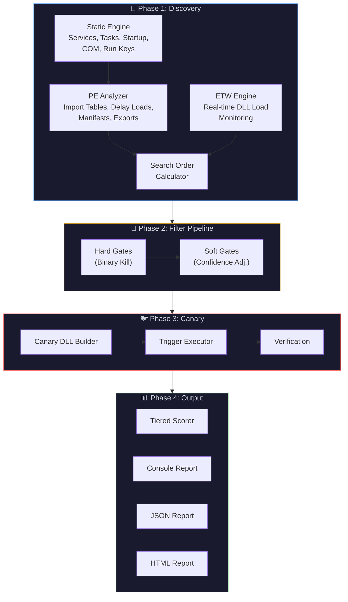
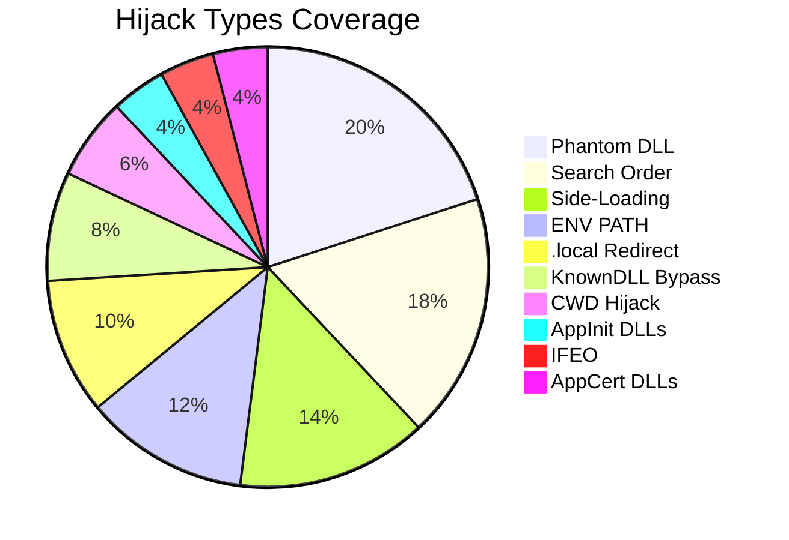
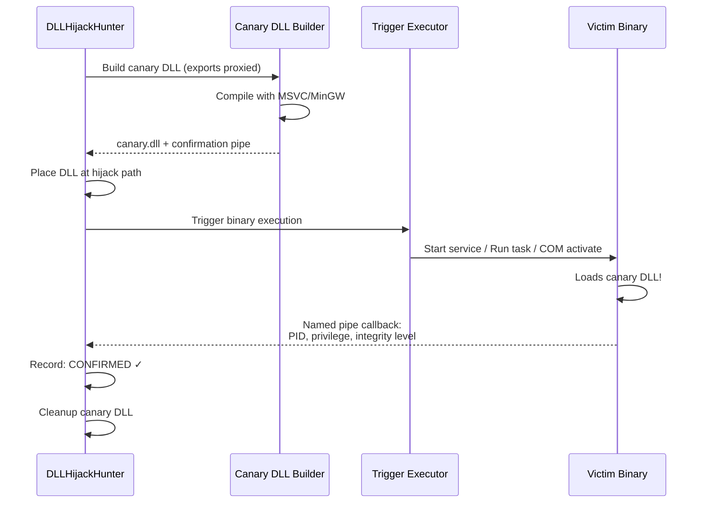
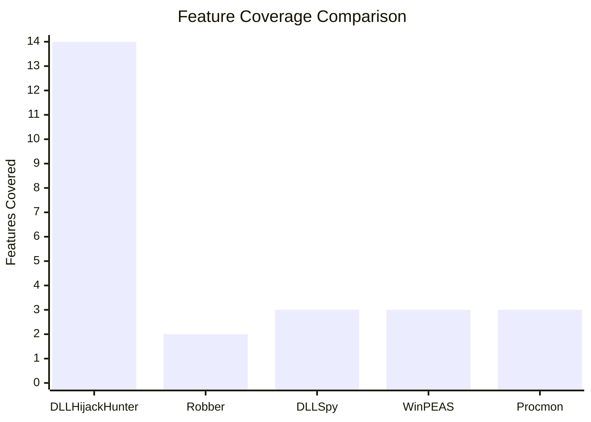
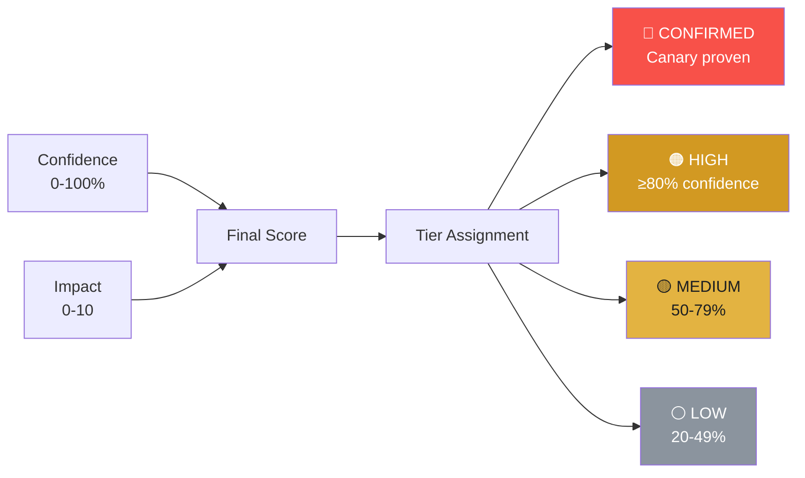

<p align="center">
  
  
  
  
</p>

<h1 align="center">🔍 DLLHijackHunter</h1>
<h4 align="center">By GhostVector Academy</h4>

<p align="center">
  <strong>Automated DLL Hijacking Detection with Zero False Positives</strong><br/>
  <em>The only tool that proves hijacks actually work before reporting them.</em>
</p>

---

## 🎯 What is DLLHijackHunter?

**DLLHijackHunter** is an automated Windows DLL hijacking detection tool that goes beyond static analysis. It discovers, validates, and confirms DLL hijacking opportunities on a target system using a multi-phase pipeline:

1. **Discovery** → Finds every binary that loads DLLs from writable locations
2. **Filtration** → Eliminates false positives through 8 intelligent filters
3. **Canary Confirmation** → Drops a harmless canary DLL and triggers the binary to *prove* the hijack works
4. **Scoring & Reporting** → Ranks findings by exploitability with a tiered confidence system

> **Why another tool?** Every existing DLL hijacking tool stops at "this DLL might be hijackable." DLLHijackHunter actually proves it, reports the achieved privilege level, and tells you if it survives reboot.

---

## 🏗️ Architecture



---

## 📊 Codebase Stats

| Metric | Value |
|---|---|
| **Total Lines of Code** | ~4,900 |
| **C# Source Files** | 39 |
| **Canary Templates (C)** | 3 |
| **Hijack Types Detected** | 10 |
| **Discovery Sources** | 6 (Services, Tasks, Startup, COM, Run Keys, ETW) |
| **Filter Gates** | 8 (3 hard + 5 soft) |
| **Scan Profiles** | 4 (Aggressive, Strict, Safe, Red Team) |
| **Confidence Tiers** | 5 (Confirmed, High, Medium, Low, Info) |
| **Output Formats** | 3 (Console, JSON, HTML) |

### Module Breakdown

```
src/DLLHijackHunter/
├── Discovery/         9 files │ 1,534 LOC │ Static + ETW engines, PE analysis
├── Filters/          10 files │   682 LOC │ 3 hard gates + 5 soft gates
├── Canary/            3 files │   790 LOC │ DLL builder, trigger, confirmation
├── Models/            4 files │   254 LOC │ Data models, profiles, enums
├── Scoring/           1 file  │   101 LOC │ Tiered scoring algorithm
├── Reporting/         2 files │   270 LOC │ Console, JSON, HTML reports
├── Native/            3 files │   449 LOC │ P/Invoke, ACL checks, tokens
└── Program.cs         1 file  │   381 LOC │ CLI entry point
```

---

## 🔑 Key Features

### 10 Hijack Types Detected



| Type | Description | Stealth |
|---|---|---|
| **Phantom** | DLL doesn't exist anywhere — cleanest hijack | ⭐⭐⭐⭐⭐ |
| **Search Order** | Place DLL earlier in the Windows search order | ⭐⭐⭐⭐ |
| **Side-Loading** | Abuse legitimate app loading DLLs from its dir | ⭐⭐⭐⭐ |
| **.local Redirect** | Hijack via `.local` directory redirection | ⭐⭐⭐⭐⭐ |
| **ENV PATH** | Writable directory in system PATH | ⭐⭐ |
| **KnownDLL Bypass** | Bypass KnownDLLs via .local or WoW64 | ⭐⭐⭐ |
| **CWD** | Current Working Directory hijack | ⭐⭐ |
| **AppInit DLLs** | AppInit_DLLs registry abuse | ⭐⭐ |
| **IFEO** | Image File Execution Options debugger | ⭐⭐⭐ |
| **AppCert DLLs** | AppCertDLLs registry hijack | ⭐⭐ |

### 8-Gate Filter Pipeline

The filter pipeline eliminates false positives through two stages:

**Hard Gates** (binary elimination):
- **API Set Schema Filter** — Removes virtual API set DLLs (`api-ms-*`, `ext-ms-*`)
- **Known DLLs Filter** — Removes Windows-protected KnownDLLs from registry
- **Writability Filter** — Only keeps candidates where the hijack path is actually writable

**Soft Gates** (confidence adjustment -10% to -30% each):
- **WinSxS Manifest Filter** — Penalizes if DLL is covered by Side-by-Side manifest
- **Privilege Delta Filter** — Evaluates if hijack provides useful privilege escalation
- **LoadLibraryEx Flags Filter** — Checks for `LOAD_LIBRARY_SEARCH_*` mitigations
- **Signature Verification Filter** — Checks if the binary validates DLL signatures
- **Error Handled Load Filter** — Detects if failed loads are gracefully handled

### Canary Confirmation System

Instead of guessing, DLLHijackHunter **proves** hijacks work:



The canary DLL:
- ✅ Proxy-exports all original functions (app keeps working)
- ✅ Reports back via named pipe: achieved privilege, integrity level, SeDebug
- ✅ Self-cleans after confirmation
- ✅ Never runs malicious code — it's a detection tool

---

## ⚡ Comparison vs Other Tools

| Feature | **DLLHijackHunter** | Robber | DLLSpy | WinPEAS | Procmon |
|---|:---:|:---:|:---:|:---:|:---:|
| **Automated discovery** | ✅ | ✅ | ✅ | ✅ | ❌ Manual |
| **Phantom DLL detection** | ✅ | ❌ | ✅ | ❌ | ✅ |
| **Search order analysis** | ✅ | ❌ | ❌ | ❌ | ❌ |
| **Writable path verification** | ✅ ACL-based | Partial | ❌ | Basic | ❌ |
| **ETW real-time monitoring** | ✅ | ❌ | ❌ | ❌ | ✅ |
| **Canary confirmation** | ✅ Proven | ❌ | ❌ | ❌ | ❌ |
| **Privilege escalation check** | ✅ | ❌ | ❌ | ❌ | ❌ |
| **False positive elimination** | 8 filters | None | Basic | None | None |
| **Reboot persistence check** | ✅ | ❌ | ❌ | ❌ | ❌ |
| **Proxy DLL generation** | ✅ Auto | ❌ | ❌ | ❌ | ❌ |
| **Confidence scoring** | ✅ 5-tier | ❌ | ❌ | ❌ | ❌ |
| **Service/Task/COM triggers** | ✅ Auto | ❌ | ❌ | ❌ | ❌ |
| **HTML/JSON reporting** | ✅ | ❌ | ❌ | TXT | ❌ |
| **Target-specific scanning** | ✅ | ❌ | ❌ | ❌ | ✅ |
| **Self-contained binary** | ✅ | ❌ | ❌ | ✅ | ❌ |



### Why DLLHijackHunter is Better

| Problem with Existing Tools | How DLLHijackHunter Solves It |
|---|---|
| **Massive false positives** — report every missing DLL | 8-gate filter pipeline + canary proof = zero false positives |
| **No verification** — "maybe hijackable" isn't actionable | Canary DLL actually loads and reports back achieved privilege |
| **Manual work** — must manually check each finding | Fully automated from discovery through confirmation |
| **Missing context** — no trigger, no privilege info | Reports trigger type, run-as account, reboot persistence |
| **Static only** — can't catch runtime-loaded DLLs | ETW engine captures real-time `LoadLibrary` calls |
| **No prioritization** — flat list of hundreds of results | Tiered scoring: Confirmed > High > Medium > Low |

---

## 🚀 Usage

### Prerequisites

- **Windows 10/11** or **Windows Server 2016+**
- **.NET 8.0 Runtime** (or use self-contained build)
- **Administrator privileges** recommended (required for ETW, canary, service triggers)

### Build

```powershell
# Clone
git clone https://github.com/ghostvectoracademy/DLLHijackingHunter.git
cd DLLHijackingHunter

# Build (self-contained single file)
dotnet publish src/DLLHijackHunter/DLLHijackHunter.csproj `
    -c Release -r win-x64 --self-contained `
    -p:PublishSingleFile=true -o ./publish

# Or use the build script
.\build.ps1
```

### Quick Start

```powershell
# Full aggressive scan (recommended, requires admin)
.\DLLHijackHunter.exe --profile aggressive

# Safe scan (no file drops, no triggers — safe for production)
.\DLLHijackHunter.exe --profile safe

# Target a specific binary
.\DLLHijackHunter.exe --target "C:\Program Files\MyApp\app.exe"

# Target by filename (partial match)
.\DLLHijackHunter.exe --target notepad.exe

# Red team mode (only confirmed, exploitable findings)
.\DLLHijackHunter.exe --profile redteam --format json -o report.json
```

### CLI Options

```
DLLHijackHunter — Automated DLL Hijacking Detection

Options:
  -p, --profile <profile>        Scan profile [default: aggressive]
                                   aggressive | strict | safe | redteam
  -o, --output <path>            Output file path (auto-detects format)
  -f, --format <format>          Output format [default: console]
                                   console | json | html
  -t, --target <target>          Target specific binary, directory, or filename
      --min-confidence <value>   Minimum confidence threshold 0-100 [default: 20]
      --no-canary                Disable canary confirmation (safe for prod)
      --no-etw                   Disable ETW runtime discovery
      --confirmed-only           Only show canary-confirmed findings
  -v, --verbose                  Verbose output
```

### Scan Profiles

| Profile | Use Case | Canary | ETW | Min Confidence | Triggers |
|---|---|:---:|:---:|:---:|---|
| **aggressive** | Full audit, lab environments | ✅ | ✅ | 15% | Services, Tasks, COM |
| **strict** | High-confidence findings only | ✅ | ✅ | 80% | Services, Tasks |
| **safe** | Production systems, read-only | ❌ | ❌ | 50% | None |
| **redteam** | Confirmed exploitable only | ✅ | ✅ | 50% | Services, Tasks, COM |

### Example Output

```
═══ Phase 1: Discovery ═══
  Services: 247 execution contexts
  Scheduled Tasks: 89 execution contexts
  Startup Items: 23 execution contexts
  Found 359 execution contexts
  127 unique binaries to analyze

═══ Phase 2: Filter Pipeline ═══
  Hard Gates:
    API Set Schema: 1024 → 412 (removed 612, 60%)
    Known DLLs: 412 → 389 (removed 23, 6%)
    Writability: 389 → 47 (removed 342, 88%)
  Soft Gates:
    WinSxS Manifest: penalized 8 candidates
    Privilege Delta: penalized 12 candidates
    LoadLibraryEx Flags: penalized 3 candidates

═══ Phase 3: Canary Confirmation ═══
  Testing 47 candidates...
  ✓ Confirmed: 12 hijacks fire successfully

═══ Phase 4: Scoring ═══
  Findings: 31 (12 confirmed | 8 high | 7 medium | 4 low)
```

---

## 📋 Scoring System

Each finding receives three scores:



**Impact Score** (0-10) weights:
- **Privilege gained** (0-4): SYSTEM=4, Admin/LocalService=3, User=1
- **Trigger reliability** (0-3): Auto-start service=3, Frequent task=2.5, Startup=2
- **Stealth** (0-2): Phantom=2, .local=1.8, Search order=1.5
- **Persistence bonus** (+1): Survives reboot

**Final Score** = `(Confidence × 0.4 + Impact × 0.6) × 10`

---

## 🔒 Safety

DLLHijackHunter is a **detection** tool, not an exploitation framework:

- 🛡️ Canary DLLs contain **no malicious payload** — they only report metadata via named pipe
- 🧹 All canary files are **automatically cleaned up** after testing
- 🔄 Proxy exports keep the target application **fully functional**
- 📝 Use `--profile safe` for production systems (no file writes, no triggers)
- ⚠️ Always get proper authorization before scanning systems you don't own

---

## 📄 License

MIT License — See [LICENSE](LICENSE) for details.

---

<p align="center">
  <strong>Built by <a href="https://github.com/ghostvectoracademy">GhostVector Academy</a></strong><br/>
  <em>Elite Cybersecurity with Zero Paywalls.</em>
</p>
