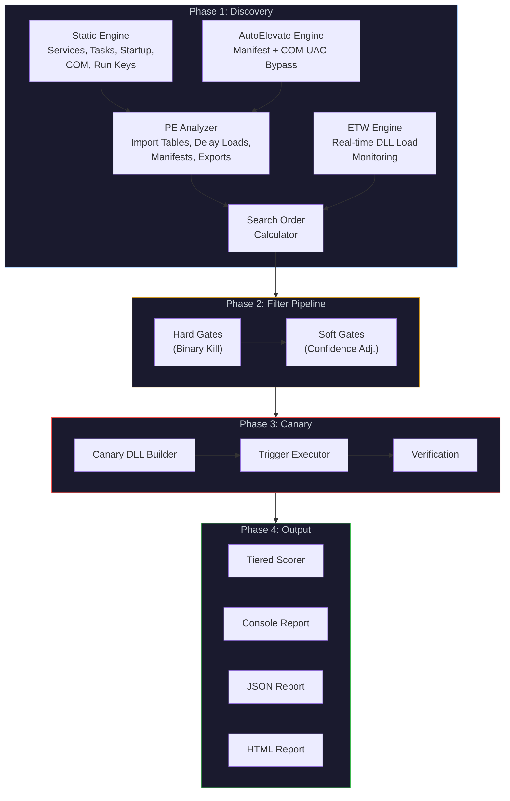
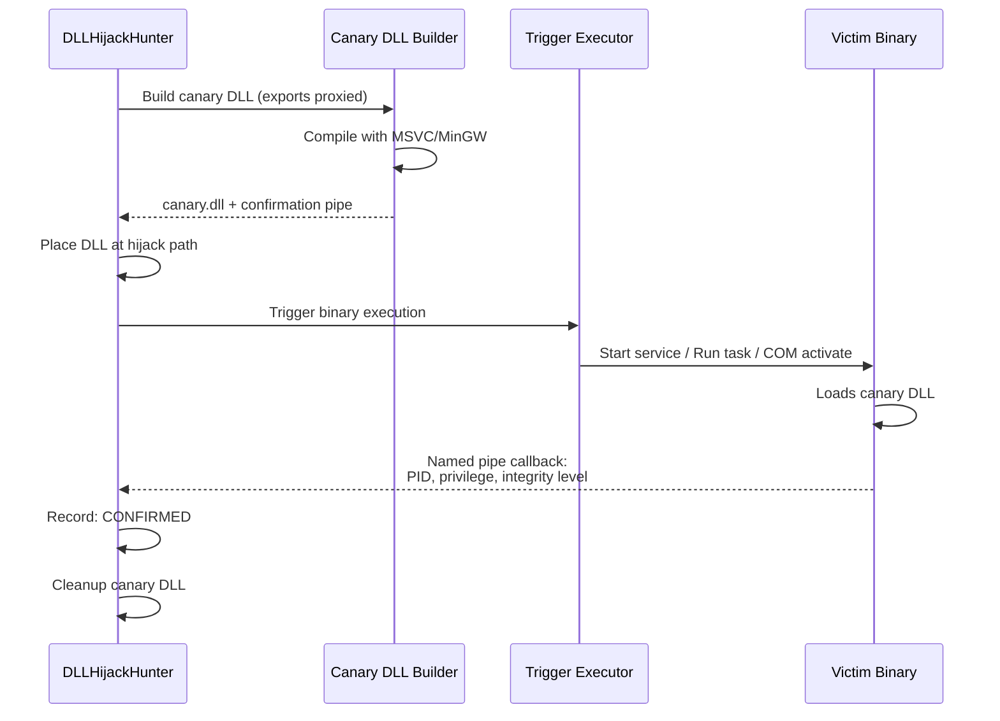
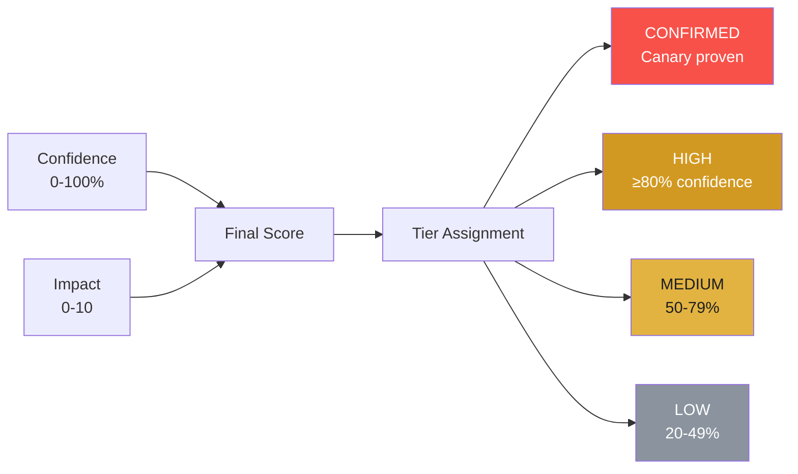

<p align="center">
  
  
  
  
</p>

<h1 align="center">DLLHijackHunter</h1>
<h4 align="center">By GhostVector Academy</h4>

<p align="center">
  <strong>Automated DLL Hijacking Discovery, Validation, and Confirmation</strong><br/>
  <em>The only tool that proves hijacks actually work before reporting them.</em>
</p>

---

## 🔍 Overview

**DLLHijackHunter** is an automated Windows DLL hijacking detection tool that goes beyond static analysis. It discovers, validates, and confirms DLL hijacking opportunities using a multi-phase pipeline:

1. **Discovery** — Enumerates binaries across services, scheduled tasks, startup items, COM objects, and AutoElevate UAC bypass vectors
2. **Filtration** — Eliminates false positives through 8 intelligent gates (hard gates + confidence-adjusting soft gates)
3. **Canary Confirmation** — Deploys a harmless canary DLL and triggers the binary to prove the hijack works
4. **Scoring & Reporting** — Ranks findings by exploitability with a tiered confidence system

> Every existing DLL hijacking tool stops at "this DLL might be hijackable." DLLHijackHunter actually proves it, reports the achieved privilege level, and identifies whether it survives reboot.

---

## 🏗️ Architecture



---

## 🎯 Key Features

### Hijack Type Coverage

| Type | Description | Stealth |
|---|---|---|
| **Phantom** | DLL doesn't exist anywhere on disk — cleanest hijack | High |
| **Search Order** | Place DLL earlier in the Windows search order | High |
| **Side-Loading** | Abuse legitimate app loading DLLs from its directory | High |
| **.local Redirect** | Hijack via `.local` directory redirection | High |
| **KnownDLL Bypass** | Bypass KnownDLLs via .local or WoW64 | Medium |
| **ENV PATH** | Writable directory in system PATH | Low |
| **CWD** | Current Working Directory hijack | Low |
| **AppInit DLLs** | AppInit_DLLs registry abuse | Low |
| **IFEO** | Image File Execution Options debugger | Medium |
| **AppCert DLLs** | AppCertDLLs registry hijack | Low |

### UAC Bypass Discovery

DLLHijackHunter includes dedicated UAC bypass detection:

- **Manifest AutoElevate** — Scans `System32` and `SysWOW64` for EXEs with `<autoElevate>true</autoElevate>` in their embedded manifests
- **COM AutoElevation** — Scans `HKLM\SOFTWARE\Classes\CLSID` for COM objects with `Elevation\Enabled=1` (covers techniques like Fodhelper, CMSTPLUA, and similar)
- **Side-Load Simulation** — For AutoElevate binaries that don't call `SetDllDirectory` or `SetDefaultDllDirectories`, simulates the "copy EXE to writable folder + drop DLL" attack vector

### Filter Pipeline

The pipeline eliminates false positives through two stages:

**Hard Gates** (binary elimination):
- **API Set Schema** — Removes virtual API set DLLs (`api-ms-*`, `ext-ms-*`)
- **Known DLLs** — Removes Windows-protected KnownDLLs from registry
- **Writability** — ACL-based check; only keeps candidates where the hijack path is writable

**Soft Gates** (confidence adjustment, -10% to -30% each):
- **WinSxS Manifest** — Penalizes if DLL is covered by Side-by-Side manifest
- **Privilege Delta** — Evaluates if hijack provides useful privilege escalation
- **LoadLibraryEx Flags** — Checks for `LOAD_LIBRARY_SEARCH_*` mitigations
- **Signature Verification** — Checks if the binary validates DLL signatures
- **Error Handled Load** — Detects if failed DLL loads are gracefully handled

### Canary Confirmation

Instead of guessing, DLLHijackHunter proves hijacks work:



The canary DLL:
- Proxy-exports all original functions (application keeps working)
- Reports back via named pipe: achieved privilege, integrity level, SeDebug status
- Self-cleans after confirmation
- Contains no malicious code — purely a detection mechanism

---

## ⚡ Comparison

| Feature | **DLLHijackHunter** | Robber | DLLSpy | WinPEAS | Procmon |
|---|:---:|:---:|:---:|:---:|:---:|
| Automated discovery | ✅ | ✅ | ✅ | ✅ | ❌ |
| Phantom DLL detection | ✅ | ❌ | ✅ | ❌ | ✅ |
| Search order analysis | ✅ | ❌ | ❌ | ❌ | ❌ |
| ACL-based writability check | ✅ | Partial | ❌ | Basic | ❌ |
| ETW real-time monitoring | ✅ | ❌ | ❌ | ❌ | ✅ |
| Canary confirmation | ✅ | ❌ | ❌ | ❌ | ❌ |
| Privilege escalation check | ✅ | ❌ | ❌ | ❌ | ❌ |
| UAC bypass discovery | ✅ | ❌ | ❌ | ❌ | ❌ |
| False positive elimination | 8 filters | None | Basic | None | None |
| Reboot persistence check | ✅ | ❌ | ❌ | ❌ | ❌ |
| Proxy DLL generation | ✅ | ❌ | ❌ | ❌ | ❌ |
| Confidence scoring | 5-tier | ❌ | ❌ | ❌ | ❌ |
| Auto trigger (svc/task/COM) | ✅ | ❌ | ❌ | ❌ | ❌ |
| HTML/JSON reporting | ✅ | ❌ | ❌ | TXT | ❌ |
| Target-specific scanning | ✅ | ❌ | ❌ | ❌ | ✅ |
| Self-contained binary | ✅ | ❌ | ❌ | ✅ | ❌ |

---

## 🚀 Usage

### Prerequisites

- **Windows 10/11** or **Windows Server 2016+**
- **.NET 8.0 Runtime** (or use self-contained build)
- **Administrator privileges** recommended (required for ETW, canary, service triggers)

### Build

```powershell
# Clone
git clone https://github.com/ghostvectoracademy/DLLHijackingHunter.git
cd DLLHijackingHunter

# Build (self-contained single file)
dotnet publish src/DLLHijackHunter/DLLHijackHunter.csproj `
    -c Release -r win-x64 --self-contained `
    -p:PublishSingleFile=true -o ./publish

# Or use the build script
.\build.ps1
```

### Quick Start

```powershell
# Full aggressive scan (recommended, requires admin)
.\DLLHijackHunter.exe --profile aggressive

# Safe scan (no file drops, no triggers — safe for production)
.\DLLHijackHunter.exe --profile safe

# UAC bypass focused scan
.\DLLHijackHunter.exe --profile uac-bypass

# Target a specific binary
.\DLLHijackHunter.exe --target "C:\Program Files\MyApp\app.exe"

# Target by filename (partial match)
.\DLLHijackHunter.exe --target notepad.exe

# Red team mode (only confirmed, exploitable findings)
.\DLLHijackHunter.exe --profile redteam --format json -o report.json
```

### CLI Options

```
DLLHijackHunter — Automated DLL Hijacking Detection

Options:
  -p, --profile <profile>        Scan profile [default: aggressive]
                                   aggressive | strict | safe | redteam | uac-bypass
  -o, --output <path>            Output file path (auto-detects format)
  -f, --format <format>          Output format [default: console]
                                   console | json | html
  -t, --target <target>          Target specific binary, directory, or filename
      --min-confidence <value>   Minimum confidence threshold 0-100 [default: 20]
      --no-canary                Disable canary confirmation (safe for prod)
      --no-etw                   Disable ETW runtime discovery
      --confirmed-only           Only show canary-confirmed findings
  -v, --verbose                  Verbose output
```

### Scan Profiles

| Profile | Use Case | Canary | ETW | UAC Bypass | Min Confidence | Triggers |
|---|---|:---:|:---:|:---:|:---:|---|
| **aggressive** | Full audit, lab environments | ✅ | ✅ | ✅ | 15% | Services, Tasks, COM |
| **strict** | High-confidence findings only | ✅ | ✅ | ❌ | 80% | Services, Tasks |
| **safe** | Production systems, read-only | ❌ | ❌ | ❌ | 50% | None |
| **redteam** | Confirmed exploitable only | ✅ | ✅ | ❌ | 50% | Services, Tasks, COM |
| **uac-bypass** | UAC bypass vectors only | ❌ | ❌ | ✅ | 20% | AutoElevate only |

---

## 📊 Scoring

Each finding receives three scores:



**Impact Score** (0-10) is composed of:

| Component | Range | Details |
|---|---|---|
| Privilege gained | 0–4 | SYSTEM = 4, Admin/LocalService = 3, User = 1 |
| Trigger reliability | 0–3 | Auto-start service = 3, UAC bypass = 2.8, Frequent task = 2.5, Startup = 2 |
| Stealth | 0–2 | Phantom = 2, .local = 1.8, Search order = 1.5, Side-load = 1.5 |
| Persistence bonus | +1 | Survives reboot |

**Final Score** = `(Confidence × 0.4 + Impact × 0.6) × 10`, clamped to 0–10.

---

## 🛡️ Safety

DLLHijackHunter is a detection tool, not an exploitation framework:

- Canary DLLs contain no malicious payload — they only report metadata via named pipe
- All canary files are automatically cleaned up after testing
- Proxy exports keep the target application fully functional
- Use `--profile safe` for production systems (no file writes, no triggers)
- Always obtain proper authorization before scanning systems you do not own

---

## 📄 License

This project is licensed under the [MIT License](LICENSE).

---

<p align="center">
  <strong>Built by <a href="https://github.com/ghostvectoracademy">GhostVector Academy</a></strong><br/>
  <em>Elite Cybersecurity with Zero Paywalls.</em>
</p>
